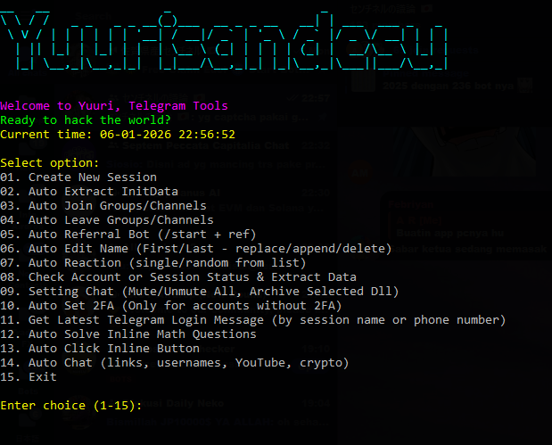

<div align="center">

# ✨ YUURI — Telegram Session Core




</div>

---

## ⬇️ Download (Windows)

### 📦 Yuuri.exe

**Direct download:**  
https://drive.google.com/uc?export=download&id=13n0p0wHCJu6BcHP34a6dzHUdvNopH3ZG

**Mirror (Google Drive page):**  
https://drive.google.com/file/d/13n0p0wHCJu6BcHP34a6dzHUdvNopH3ZG/view?usp=sharing

📌 **Notes**
- Place `Yuuri.exe` in the same directory as this repository  
- Do not rename the executable  
- Run the file directly after download

---

## 🛠️ Installation & Directory Structure

```
tg-session-core/
├─ Yuuri.exe
├─ Session/
│  ├─ account1.session
│  ├─ account2.session
│  └─ ...
├─ image/
│  └─ image.png
└─ README.md
```

📁 The `Session` folder will be created automatically if it does not exist.

---

## 🔐 License Activation

This application **requires a valid license** to run.

### How to obtain a license
1. Open the Telegram bot:  
   https://t.me/SentinelicenseBot/?start=6004380466
2. Select the label: **TELEGRAM**
3. Copy the generated license key
4. Paste the license key when the program requests it

⏳ Expired or invalid licenses will cause the application to exit automatically.

---

## ✨ Full Feature List

### 1️⃣ Create New Session
- Login to Telegram accounts using OTP  
- Supports accounts with **2FA enabled**  
- Sessions are stored locally in `.session` (SQLite) format  
- Session names are generated automatically using username or user ID

---

### 2️⃣ Auto Extract InitData (Telegram WebApp)
- Extracts `tgWebAppData` from Telegram Mini Apps  
- Supports multiple sessions in one run  
- Output files:
  - `query.txt` → raw initData  
  - `user.txt` → initData reordered with `user` parameter first  
- Commonly used for Mini Apps, airdrops, and automation workflows

---

### 3️⃣ Auto Join Groups / Channels
- Join multiple groups or channels automatically  
- Supported inputs:
  - public links  
  - private invite links (`t.me/+xxxx`)  
- Optional features:
  - auto mute after joining  
  - auto archive after joining

---

### 4️⃣ Auto Leave Groups / Channels
- Mass leave groups or channels  
- Supported formats:
  - links  
  - `@username`  
  - channel ID (`-100xxxxxxxxxx`)

---

### 5️⃣ Auto Referral Bot
- Automatically sends `/start` commands to bots  
- Supports referral codes  
- Bots are automatically muted and archived after execution

---

### 6️⃣ Auto Edit Name
- Bulk editing of Telegram profile names  
- Available modes:
  - Replace first name  
  - Append first name  
  - Replace last name  
  - Append last name  
  - Delete last name

---

### 7️⃣ Auto Reaction
- React to a single message using multiple accounts  
- Reaction modes:
  - one emoji for all sessions  
  - random emoji from a selected list  
- Supports:
  - public channels  
  - private channels (`t.me/c/...`)  
  - topic messages

---

### 8️⃣ Check Account / Session Status
- Displays detailed account information:
  - active / inactive status  
  - name and username  
  - phone number  
  - user ID  
  - premium status  
  - scam or restricted flags  
- Optional export:
  - `number.txt`  
  - `userid.txt`

---

### 9️⃣ Chat Settings (Mass Control)
- Mute all chats  
- Unmute all chats  
- Archive selected groups or channels  
- Block users and delete chat history

---

### 🔟 Auto Set 2FA
- Enable 2FA passwords for multiple accounts  
- Only applies to accounts without existing 2FA  
- Does not overwrite existing passwords

---

### 1️⃣1️⃣ Get Latest Telegram Login Message
- Retrieve the most recent Telegram login or OTP message  
- Search by:
  - session name  
  - phone number  
- Message sources:
  - Telegram official service (777000)  
  - fallback to Saved Messages

---

## 📜 License

This script is distributed for **educational and testing purposes only**.  
Any usage beyond this scope is the sole responsibility of the user.

For updates and announcements, join the Telegram group:  
https://t.me/sentineldiscus

---

## ⚠️ Disclaimer

Use of this tool is entirely at your own risk.  
The developer is not responsible for any misuse or damage resulting from the use of this software.

